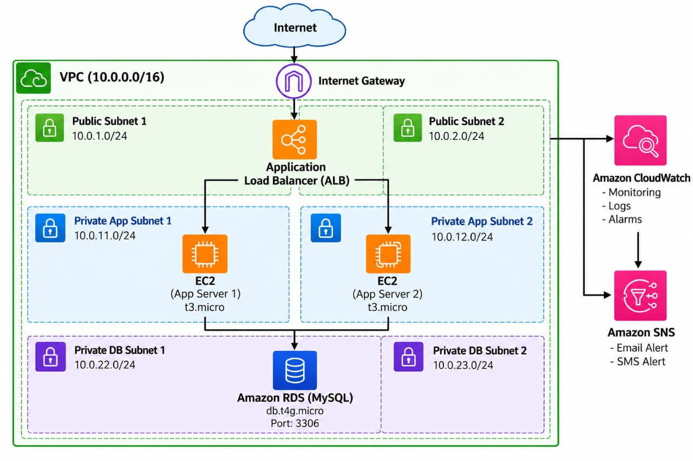

# AWS 3-Tier Architecture Project

## Project Overview

This is a hands-on AWS project where I built a simple 3-Tier Architecture.

### Architecture

Internet
↓
Internet Gateway
↓
Application Load Balancer
↓
EC2 App Servers
↓
RDS MySQL

## AWS Services Used

- VPC
- Subnets
- Internet Gateway
- NAT Gateway
- Route Tables
- Security Groups
- EC2
- Application Load Balancer
- Target Group
- Auto Scaling
- RDS MySQL
- IAM
- Systems Manager
- CloudWatch
- SNS

## Network

VPC:
`10.0.0.0/16`

Public Subnets:
- `10.0.1.0/24`
- `10.0.2.0/24`

Private App Subnets:
- `10.0.11.0/24`
- `10.0.12.0/24`

Private DB Subnets:
- `10.0.22.0/24`
- `10.0.23.0/24`

## Application Layer

- Amazon Linux 2023
- Nginx
- EC2 `t3.micro`
- Auto Scaling: Minimum 2, Desired 2, Maximum 4
- Application Load Balancer

## Database Layer

- Amazon RDS MySQL
- Instance: `db.t4g.micro`
- Port: `3306`
- Public Access: No

## Database Practical

Connected to RDS from a private EC2 instance using Systems Manager Session Manager.

Created:

```sql
CREATE DATABASE devops_demo;
```

Created an `employees` table and tested:

- INSERT
- SELECT
- UPDATE
- DELETE

## Monitoring

CloudWatch was used to monitor the RDS instance.

SNS was configured for alarm notifications.

## Security

The database was kept private.

```text
Internet
   ↓
ALB
   ↓
Private EC2
   ↓
Private RDS
```

RDS MySQL port `3306` was allowed only from the application Security Group.

## Project Testing

- ALB application page tested successfully
- EC2 instances were healthy
- Target Group showed healthy targets
- EC2 → RDS MySQL connection tested
- MySQL CRUD operations tested
- CloudWatch alarm configured

## Architecture Diagram



## Screenshots

Project screenshots are available in the `screenshots` folder.

## What I Learned

- AWS VPC networking
- Public and private subnets
- Load Balancing
- EC2
- Auto Scaling
- RDS MySQL
- IAM
- Security Groups
- CloudWatch
- SNS
- Systems Manager
- Basic AWS 3-Tier Architecture


